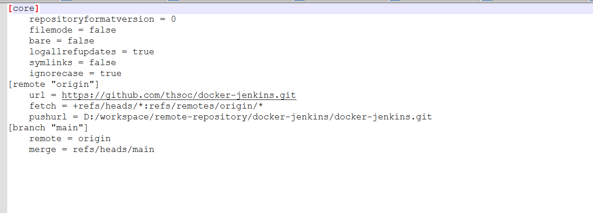
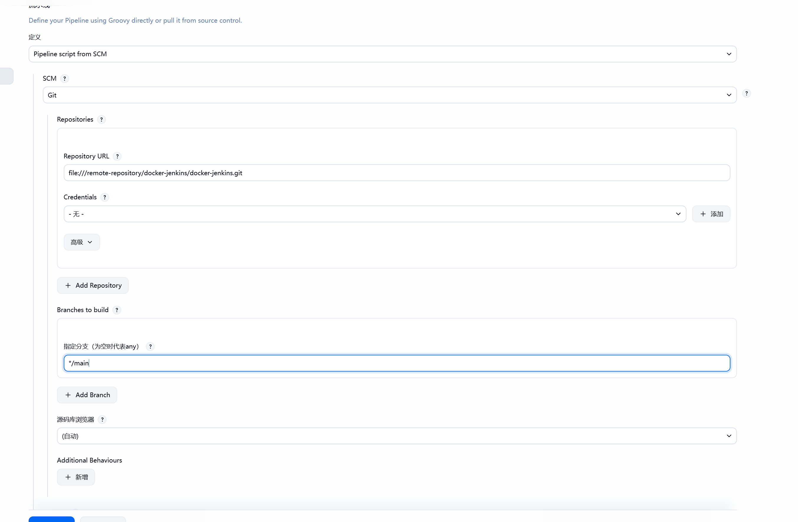

## 准备工作
### 准备本地 Git 仓库（模拟远程仓库）
```bash
# 创建裸仓库作为"远程"仓库
mkdir -p D:/workspace/remote-repository/docker-jenkins/docker-jenkins.git
cd D:/workspace/remote-repository/docker-jenkins/docker-jenkins.git
git init --bare
# 修改默认分支为 main
git symbolic-ref HEAD refs/heads/main
# 验证
git symbolic-ref HEAD
# 输出：refs/heads/main

# 创建项目代码目录
cd D:/workspace/java/docker-jenkins
git init
# 设置 origin 同时包含两个地址
# 第一步：先创建 origin（指向 GitHub，为了代码托管，使用watt加速）
git remote add origin https://github.com/thsoc/docker-jenkins.git
# 第二步：再添加第二个 push 地址（指向本地裸仓库，jenkin需要，实际开发只需要第一步，这里是因为docker jenkins无法拉取github代码（网络问题，这边设置本地仓库作为"远程"仓库））
git remote set-url --add --push origin D:/workspace/remote-repository/docker-jenkins/docker-jenkins.git
git remote set-url --add --push origin https://github.com/thsoc/docker-jenkins.git
# 验证配置
git remote -v
# 输出应该类似：
# origin  https://github.com/thsoc/docker-jenkins.git(fetch)
# origin  https://github.com/thsoc/docker-jenkins.git(push)
# origin  D:/workspace/remote-repository/docker-jenkins/docker-jenkins.git (push)

```




### 创建[Dockerfile](../Dockerfile)（可以前端后端各一个文件夹有各自的doockerfile）

### 创建[docker-compose.yml](../docker-compose.yml)

### 创建[Jenkinsfile](../Jenkinsfile)

### 创建[Jenkins-start.sh](Jenkins-start.sh)


## 配置
### 启动jenkins
#### 访问 http://localhost:8080

#### 获取密码
```bash
docker ps
docker exec <容器名> cat /var/jenkins_home/secrets/initialAdminPassword
## 0a35e40cdde3444688c2d498a6ea4d17
```
#### 下载插件
```bash
# jenkins容器内下载docker(正式环境不用做)
docker exec -it -u root jenkins bash
curl -fsSL https://download.docker.com/linux/static/stable/x86_64/docker-24.0.9.tgz -o docker.tgz && tar -xvzf docker.tgz && mv docker/docker /usr/local/bin/ && rm -rf docker docker.tgz
docker version

## 设置插件加速
# Manage Jenkins → Plugins → Advanced，把 Update Site 的 URL 改为
https://mirrors.tuna.tsinghua.edu.cn/jenkins/updates/update-center.json
# 替换 default.json 中的下载地址
docker exec -u root jenkins bash -c "sed -i 's#https://updates.jenkins.io/download#https://mirrors.tuna.tsinghua.edu.cn/jenkins#g' /var/jenkins_home/updates/default.json && sed -i 's#https://www.google.com#https://www.baidu.com#g' /var/jenkins_home/updates/default.json"
#重启
docker restart jenkins
# 插件管理界面安装
1.Pipeline，2.Git，3.Docker Pipeline，4.Localization: Chinese (Simplified) 5.JUnit

# 安装maven，可页面配置
Manage Jenkins → Tools → Maven → Add Maven 填名称 Maven-3.9，版本选 3.9.9，勾选自动安装

```

#### 配置Jenkinsfile
```txt
1. 新建任务 → 选择 "流水线（Pipeline）"
2. 在 Pipeline 配置区域选择 "Pipeline script from SCM" （或者在 Pipeline 配置区域选择 "Pipeline script"（不是 from SCM）在编辑器中直接粘贴流水线代码）
3. SCM下拉填写 Git 仓库地址和分支，
4. Repository URL:[http://git地址/myapp.git ]
    这里使用本地假远程仓库：file:///remote-repository/docker-jenkins/docker-jenkins.git
    如果使用本地仓库需要docker desktop开启文件共享和启动的时候挂载仓库路径
5. Credentials:git-cred（选凭据（账号密码））
6. Branches to build： Branch Specifier：/main
7. Script Path 填写 Jenkinsfile（这是默认值）
```


## 验证
### 修改代码提交查看访问


